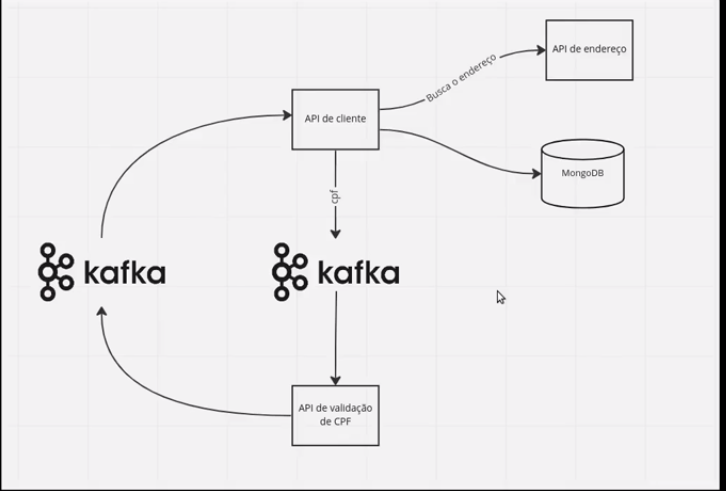

# hexagonal api

> API de exemplo para o projeto whats app cloud , com arquitetura hexagonal , banco NOSQL Mongo e conectividade com produtores e consumidores kafka

# Requisitos
java 17

Docker compose

Plugin Lombok

WireMock

MongoDB

Apache Kafka

# Passo a passo para subir a aplicação

baixar o JAR do WireMock em https://wiremock.org/docs/download-and-installation/

subir o WireMock na porta 8082 , para isso vá até a pasta onde realizou o download e execute:

java -jar wiremock-standalone-3.1.0.jar --port 8082

serão criadas mais duas pastas no local onde esta o JAR , nomes das pastas: mappings e _files

dentro da pasta mappings, inserir os arquivoa abaixo para simular uma das apis mockadas:

address.json

{
"request": {
"method": "GET",
"url": "/addresses/38400000"
},
"response": {
"status": 200,
"headers": {
"Content-Type": "application/json"
},
"jsonBody": {
"street": "Rua Hexagonal",
"city": "Uberlândia",
"state": "Minas Gerais"
}
}
}

address_2.json

{
"request": {
"method": "GET",
"url": "/addresses/38400001"
},
"response": {
"status": 200,
"headers": {
"Content-Type": "application/json"
},
"jsonBody": {
"street": "Rua das Flores",
"city": "São Paulo",
"state": "São Paulo"
}
}
}

saia do Wiremock ( pare a sua execução e entre novamente para que a atualização dos arquivos seja realizada)

# subir o kafka e o mongo através do docker compose:

entre na pasta docker-compose via linha de comando e suba os containers com:

docker-compose up

# Rodar a app na sua IDE

No intellij , rode a classe HexagonalApplication

